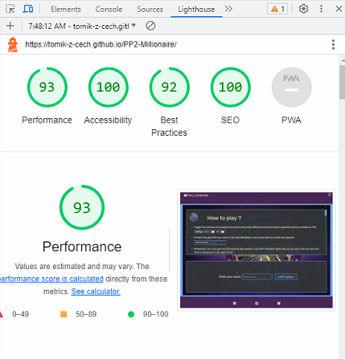
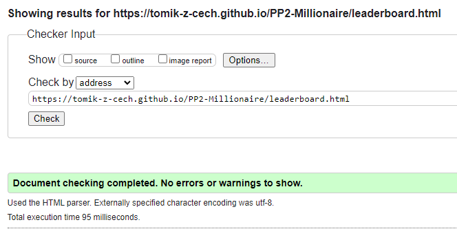
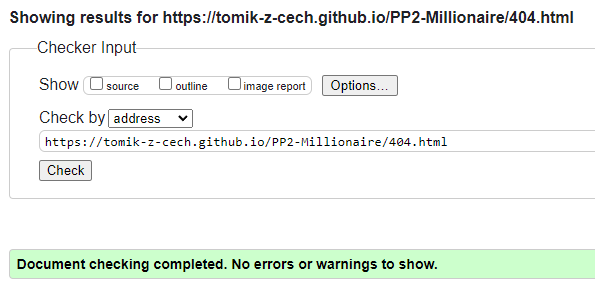

# ***Millionaire - Portfolio Project 2***
---
# **1. Key project information**

- **Description :** This Portfolio Project 2 website called **Millionaire** is an online game (quiz) that allows the user to test their general knowledge, collect points into score that is time relevant and make an entry to leder board.
- **Key project goal :** To entertain users of this page and test their trivia knowledge attempting the **Millionaire** game.
- **Audience :** There's no age or any other limit to audience of this page. Target audience are any users searching for trivia games.
- **Live version :** Live version of **Millionaire** game can be viewed [here](https://tomik-z-cech.github.io/PP2-Millionaire/) .

---

# **2. Table of content**

- [1. Key project information](https://github.com/tomik-z-cech/PP2-Millionaire#1-key-project-information)
- [2. Table of content](https://github.com/tomik-z-cech/PP2-Millionaire#2-table-of-content)
- [3. Rules of Game](https://github.com/tomik-z-cech/PP2-Millionaire#3-rules-of-game)
- [4. Color palette](https://github.com/tomik-z-cech/PP2-Millionaire#4-color-palette)
- [5. Site map](https://github.com/tomik-z-cech/PP2-Millionaire#5-site-map)
- [6. Features](https://github.com/tomik-z-cech/PP2-Millionaire#6-features)
    - [6.1. Features used in every HTML document](https://github.com/tomik-z-cech/PP2-Millionaire#61-features-used-in-every-html-document)
    - [6.2. Main HTML documents](https://github.com/tomik-z-cech/PP2-Millionaire#62-main-html-documents)
    - [6.3. Existing Features summary](https://github.com/tomik-z-cech/PP2-Millionaire#63-existing-features-summary)
    - [6.4. Future Features](https://github.com/tomik-z-cech/PP2-Millionaire#64-future-features)
- [7. Wireframes](https://github.com/tomik-z-cech/PP2-Millionaire#7-wireframes)
- [8. Testing](https://github.com/tomik-z-cech/PP2-Millionaire#8-testing)
    - [8.1. Testing via Google Chrome Developer Tools](https://github.com/tomik-z-cech/PP2-Millionaire#81-testing-via-google-chrome-developer-tools)
    - [8.2. Physical testing by developer](https://github.com/tomik-z-cech/PP2-Millionaire#82-physical-testing-by-developer)
    - [8.3. Physical testing by users](https://github.com/tomik-z-cech/PP2-Millionaire#83-physical-testing-by-users)
    - [8.4. Lighthouse testing](https://github.com/tomik-z-cech/PP2-Millionaire#84-lighthouse-testing)
    - [8.5. Validators testing](https://github.com/tomik-z-cech/PP2-Millionaire#85-validators-testing)
    - [8.6. Accessibility testing (WAVE Web Accessibility Evaluation Tools)](https://github.com/tomik-z-cech/PP2-Millionaire#86-accessibility-testing-wave-web-accessibility-evaluation-tools)
    - [8.7. Bugs](https://github.com/tomik-z-cech/PP2-Millionaire#87-bugs)
    - [8.8. Responsiveness testing](https://github.com/tomik-z-cech/PP2-Millionaire#88-resposiveness-testing)
- [9. JavaScript](https://github.com/tomik-z-cech/PP2-Millionaire#9-JavaScript)
    - [9.1. Flowchart](https://github.com/tomik-z-cech/PP2-Millionaire#91-flow-chart)
    - [9.2. Question explanation](https://github.com/tomik-z-cech/PP2-Millionaire#92-question-explanation)
- [10. Deployment ](https://github.com/tomik-z-cech/PP2-Millionaire#10-deployment)
    - [10.1. Transfer of progress from IDE](https://github.com/tomik-z-cech/PP2-Millionaire#101-transfer-of-progress-from-ide)
    - [10.2. Deployment to GitHub Pages](https://github.com/tomik-z-cech/PP2-Millionaire#102-deployment-to-github-pages)
    - [10.3. Offline cloning](https://github.com/tomik-z-cech/PP2-Millionaire#103-offline-cloning)
- [11. Technologies & Credits](https://github.com/tomik-z-cech/PP2-Millionaire#11-technologies--credits)
  - [11.1. Technologies used to develop and deploy this project](https://github.com/tomik-z-cech/PP2-Millionaire#111-technologies-used-to-develop-and-deploy-this-project)
  - [11.2. Credits](https://github.com/tomik-z-cech/PP2-Millionaire#112-credits)

---

# **3. Rules of Game**

- User can toggle the switches for background music and sound effects for the best game experience (Only available on PC) *(appendix 1)*.
- User starts the game by filling their name in the text field on the bottom of page, name cannot contain any spaces *(appendix 2)*.
- User has 30 seconds per question, time will start right away as the game elements display and timer is displayed in top right corner *(appendix 3)*.
- User's progress is indicated in the progress bar on the left *(appendix 4)*.
- User can avail of three lifelines :
  - Extra time (30seconds added to the timer) *(appendix 5)*
  - Change the question (Different question is displayed) *(appendix 6)*
  - 50:50 (Two incorrect answers are removed) *(appendix 7)*
- The score is counted the following way :
  - Each question has a weight between €5 and €20.000
  - After answering the question correctly, the weight is multiplied by the time left.
  - Score for each question is added to the final score figure.
  - Current score is displayed in top left corner *(appendix 8)*.
- There're 10 questions in total, with 3 different levels of difficulty
  - Questions 1-3 : Easy
  - Questions 4-6 : Medium
  - Questions 4-6 : Hard
  - Final Question 10 : Super Hard
- The game is over when :
  - User runs out of time on any question - no win.
  - User answers wrong any of the questions - no win.
  - User answers all questions correctly - user wins.
- If user wins the game, the final score will be recorded in the leader board in user's local browser.
 
*Appendix 1 - Sound effects toggles*

*Appendix 2- Name input field*

*Appendix 3 - Timer container*

*Appendix 4 - Progress Bar (Money bar)*

*Appendix 5 - Extra Time*

*Appendix 6 - Different question*

*Appendix 7 - 50:50*

*Appendix 8 - Score container*

[Back to Table of content](https://github.com/tomik-z-cech/PP2-Millionaire#2-table-of-content)

---

# **4. Color palette**

Following color palette was chosen as it does resemble colors of the Millionaire TV show logo *(appendix 9)*.

*Appendix 9 - Color palette*

[Back to Table of content](https://github.com/tomik-z-cech/PP2-Millionaire#2-table-of-content)

---

# **5. Site map**

---

# **6. Features**

## **6.1. Features used in every HTML document**

### **Header**
- Header contains a Logo section *(appendix 10)* which is also used as a link to Home page `index.html` in the left top corner and Menu section *(appendix 11)* for easy navigation through both project pages. Menu is designed to change to "hamburger menu" *(appendix 12)* when the resolution changes to less than 1140 pixels in width.
- Header is designed to have fixed position on top of page `top: 0px` through all browsing.
- Header is designed to cover full width `width: 100%` of the browsing window.
- Header is semi-transparent using `background-color: rgba(65, 15, 60, 0.85);`.
- This will allow user to navigate through the `index.html` and `leaderboard.html` when clicked.
- Header appears same on all devices.

*Appendix 10 - Logo*

*Appendix 11 - Menu*

*Appendix 12 - "Hamburger menu"*

[Back to Table of content](https://github.com/tomik-z-cech/PP2-Millionaire#2-table-of-content)

### **Footer**
- Footer is designed to allow user to visit profiles/pages of real "Who wants to be a millionaire" TV show of Social network platforms (Facebook, Twitter, Instagram) via links that open in new browser tabs *(appendix 13)*.
- Footer is designed to have fixed position on the bottom of page `bottom: 0px` through all browsing.
- Footer is designed to cover full width `width: 100%` of the browsing window.
- Footer is semi-transparent using `background-color: rgba(65, 15, 60, 0.85);;`.
- This will allow user to open all social networks links in new tabs.
- Footer appears same on all devices.

*Appendix 13 - Social links*

[Back to Table of content](https://github.com/tomik-z-cech/PP2-Millionaire#2-table-of-content)

### **Favicon**
- Both of the HTML documents in this project are equipped with Favicon. This is to ease navigation for user in case of more tabs opened. Logo of *Who wants to be a millionaire TV show* was selected as Favicon *(appendix 14)*. 

*Appendix 14 - Favicon*

[Back to Table of content](https://github.com/tomik-z-cech/PP2-Millionaire#2-table-of-content)

### **404.html**
- This project is designed to have custom `404.html` page *(appendix 15)*. In case of user clicks on broken link user isn't completely "cut off" from browsing, instead a page with header and footer appears and user is informed of the situation. 

*Appendix 15 - 404.html*

[Back to Table of content](https://github.com/tomik-z-cech/PP2-Millionaire#2-table-of-content)

### **Scroll bar**
- This project is designed to browse without scrolling on the main HTML documents. Scrolling is used to navigate through `rules container` and `leaderboard` container *(appendix 16)*.

*Appendix 16 - Scroll bar*

[Back to Table of content](https://github.com/tomik-z-cech/PP2-Millionaire#2-table-of-content)

## 6.2. Main HTML documents

### **Rules page**

- **File :** `index.html`
- **Title :** `Millionaire ¦ Play !`
- **User :** Explains the rules of this trivia game to the user and awaits for user's name input. *(appendix 17)*.
- **Development :** User's input is read into `playerName` variable and checked against incorrect name format (name cannot be empty string and cannot contain spaces) - `function checkName()`. Page linked with `script.js` file.

*Appendix 17 - Rules page*

[Back to Table of content](https://github.com/tomik-z-cech/PP2-Millionaire#2-table-of-content)

### **Game Page**

- **File** : `index.html`
- **Title** : `Millionaire ¦ Play !`
- **User** : Once user inputs their name in requerequired format, the user is brought to game section of `index.html` *(appendix 18)*.
- **Development :**
  - After clicking "Let's play !" button with name filled in required format, name is checked by `function checkName()` and `function prepareGameView()` is called. Page linked with `script.js` file.

*Appendix 18 - Reservation page*

[Back to Table of content](https://github.com/tomik-z-cech/PP2-Millionaire#2-table-of-content)

### **Leader Board Page**

- **File** : `leaderboard.html`
- **Title** : `Millionaire ¦ Leader Board`
- **User** : User is able to see the top 10 players they did finish the game. *(appendix 19)*.
- **Development :**  This page is linked with `readstorage.js` file. Leader board uses `localStorage` as a place to hold game data, hence the leader board isn't global, `function readStorage()` is called after DOM loaded.

*Appendix 19 - Leader Board page*

[Back to Table of content](https://github.com/tomik-z-cech/PP2-Millionaire#2-table-of-content)

## **6.3. Existing Features summary**
- Users of this site are able to read the rules of the game, enter their game name, stitch on/off (off by default) the back ground music and/or sound effects on the rules page.
- Name is validated for incorrect format, users are prompted with set of randomly selected questions.
- Users are able to use three different lifelines.
- After answering all questions correctly, score is stored in local storage.
- Site responses to different view-port sizes.

[Back to Table of content](https://github.com/tomik-z-cech/PP2-Millionaire#2-table-of-content)

## **6.4. Future Features**
- To use globally run code and global storage to save scores online.
- To add "question editor", to enable admins to create/edit/delete questions without manually editing `questions.json` file.
- To add dark/light mode setting toggle.
- Add keyboard event listeners for accessibility reasons.

[Back to Table of content](https://github.com/tomik-z-cech/PP2-Millionaire#2-table-of-content)

---

# **7. Wireframes**
| Name of page | Wireframe PC | Wireframe Phone
|--|--|--|
| **index.html - rules section** | *appendix 20* | *appendix 21*  |
| **index.html - game section** | *appendix 22* | *appendix 23*  |
| **leaderboard.html** | *appendix 24* | *appendix 25*  |
| **vertical mask for screens with width > height** | N/A | *appendix 26*  |

[Back to Table of content](https://github.com/tomik-z-cech/PP2-Millionaire#2-table-of-content)

*Appendix 20 - Wireframe - index.html - rules section - PC*

*Appendix 21 - Wireframe - index.html - rules section - Phone*

*Appendix 22 - Wireframe - index.html - game section - PC*

*Appendix 23 - Wireframe - index.html - game section - Phone*

*Appendix 24 - Wireframe - leaderboard.html PC*

*Appendix 25 - Wireframe - leaderboard.html Phone*

*Appendix 26 - Wireframe - vertical mask - only applicable on screens with width > height*

[Back to Table of content](https://github.com/tomik-z-cech/PP2-Millionaire#2-table-of-content)

---

# **8. Testing**
## **8.1 Testing via Google Chrome Developer Tools**
- **Task :** To test the project for responsiveness in Google Chrome Developer Tools, to ensure correct `@media screen and (max-width: ... )` is enabled and all elements of the project are responding to changing view-port.
- **Method :** Project was displayed via Google Chrome browser, Developer tools were opened and view-port size changed to different sizes.
- **Expected result :** Project does response to three levels of view-port sizes.
- **Actual result :** Project is fully responsive in three levels, view-port width **up to 1140px** (mobile phone devices and tablets), **view-port width 1141px - 1600px** (laptops) and **view-port width over 1600px** (full HD devices). No content is distorted.
- **Overall result :** Pass

[Back to Table of content](https://github.com/tomik-z-cech/PP2-Millionaire#2-table-of-content)

## **8.2. Physical testing by developer**
- **Task :** To physically test the final project responsiveness on different devices with different view-port.
- **Method :** Project was tested on following devices : 
  - IPhone 8 - mobile phone with small view-port
  - Samsung Fold Z4 - mobile phone with large view-port
  - FireHD 8 - tablet with small view-port
  - Samsung Galaxy tab S6 - tablet with large view-port
  - PC with resolution 1366px * 768px (HD)
  - PC with resolution 1920px * 1080px (Full HD)  
- **Expected result :** Project does response without distortion on all devices.
- **Actual result :**  No content is distorted on any of the listed devices.
- **Overall result :** Pass
---
- **Task :** To physically test the final project functionality and local storage in different browsing applications.
- **Method :** Project was tested in following applications : 
  - Google Chrome
  - Mozilla Firefox
  - Microsoft Edge
  - Opera
  - Safari
- **Expected result :** Project does function in all web browsers.
- **Actual result :**  No content is distorted in any of the listed browsers and project keeps functionality, all navigation links are working and local storage does function without problems.
- **Overall result :** Pass
---
- **Task :** To physically test navigation through the game including lifelines, correct/incorrect answers, run out of time scenario.
- **Method :** Navigate from `index.html` to the game and play as many possible game cycles to try to simulate different game scenarios/outputs.
- **Expected result :** After answering all questions, score is recorded in local storage, otherwise reason for not being successful is given to user.
- **Actual result :**  As expected, tested scenarios were working without problems, lifelines were used without problems. Score is being read, sliced and recorded every time tested.
- **Overall result :** Pass

[Back to Table of content](https://github.com/tomik-z-cech/PP2-Millionaire#2-table-of-content)

---

## **8.3. Physical testing by users**
- **Task :** To test "user-friendliness" and possible bugs that weren't found by developer testing.
- **Method :** Group of users were given link to deployed project to play with and send feedback.

|User|Amy Parlon  |
|--|--|
| Feedback given | Very enjoyable and user-friendly. Love trivia games and this is super easy to navigate through. Check spelling of questions. |
| Applied changes | Spell check on question.json performed. Commit [bec6d30](https://github.com/tomik-z-cech/PP2-Millionaire/commit/bec6d30315fc2c262d4c8d6c8df1670ad2d5ac32)  |
---
|User|Kyle Kennedy  |
|--|--|
| Feedback given | When the levels are all complete there isn't natural way to start a new game. |
| Applied changes | Added "Play again button" to the bottom of leader board. Commit [2e1f750](https://github.com/tomik-z-cech/PP2-Millionaire/commit/2e1f750822edf11a13403fccb1bb6e0baf7b18c1). |
---
|User|Eamonn Ryan   |
|--|--|
| Feedback given | All looks good and working just fine. Might be no harm to add rotate your phone icon. |
| Applied changes | Added "Rotate your phone" to the vertical mask to `*.html`. Commit [e0fa355](https://github.com/tomik-z-cech/PP2-Millionaire/commit/e0fa355180211d558bbd78f96dc548812be6e003) |
---

[Back to Table of content](https://github.com/tomik-z-cech/PP2-Millionaire#2-table-of-content)

---

---
## **8.4. Lighthouse testing**
- `*.html` documents were tested via Lighthouse with very good results (*appendix 27*). Suggestion was made on page `index.html` to use `webp` image format instead of current `png` format.

*Appendix 27 - Lighthouse testing - `index.html`*

[Back to Table of content](https://github.com/tomik-z-cech/PP2-Millionaire#2-table-of-content)

---

## **8.5. Validators testing**

### Jigsaw CSS validator
- **Method :** Project (`styles.css`) was tested by  [W3C CSS Validator](https://jigsaw.w3.org/).
- **Result :** No errors were found when tested (*appendix 28*).

*Appendix 28 - Jigsaw CSS Validator testing - `styles.css`*

### W3C HTML validator
- **Method :** Every HTML document was tested by  [W3C Validator](https://validator.w3.org/).
- **Result :** Initial validating found 1 error (stray `</img>` tags. Stray tags were removed and there were no future errors found after this fix. Commit [f66c933](https://github.com/tomik-z-cech/PP2-Millionaire/commit/f66c933fb608ccd7affed0a8e73c3ac19ff52ce9).

[Back to Table of content](https://github.com/tomik-z-cech/PP2-Millionaire#2-table-of-content)

|File|Appendix  |
|--|--|
|`index.html`  |*appendix 29*  |
|`leaderboard.html`  |*appendix 30*  |
|`404.html`  |*appendix 31*  |

*Appendix 29 - W3C Validator testing - `index.html`*

*Appendix 30 - W3C Validator testing - `leaderboard.html`*

*Appendix 31 - W3C Validator testing - `404.html`*

[Back to Table of content](https://github.com/tomik-z-cech/PP2-Millionaire#2-table-of-content)

### JSHint Java Script validator
- **Method :** `*.js` files were tested using  [JS Hint Validator](https://jshint.com/) using `//jshint esversion: 6` as first line to enable version 6 of Java Script to be taken into consideration
- **Result :** Initial validating found multiple errors with unnecessary semicolons `;`. This was adjusted and there are no more errors. Three functions are being seen as unused. They are used, but being called from `index.html` as stated in bugs section. This validator also display two warnings stating that loops are calling global variables *(appendix 32 and appendix 33)*.

*Appendix 32 - JS Hint Validator testing - `script.js`*

*Appendix 33 - JS Hint Validator testing - `readstorage.js`*

## **8.6. Accessibility testing (WAVE Web Accessibility Evaluation Tools)**

 - **Method :** Every HTML document was tested by  [WAVE Web Accessibility Evaluation Tool](https://wave.webaim.org/). This testing had to be done in different stages of game as the background and foreground colors do change in reaction of events.
 - **Focus :** This test focused on the following. 
      - Every page has a language declared in header for page readers
      - WCAG Coding Practices are followed
      - All forms have correct aria labels `aria-label="..."`
      - All images have correct alt labels `<alt="...">`
      - Heading levels are in correct order `<h1> - <h2> - <h3>`
      - Correct contrast ratio - **minimal contrast ratio 4.5:1**

 - **Result :** Automated testing found no errors, 3 alerts are still present. The cause of alerts are event listeners that are waiting for mouse-click only. Those alerts could be avoided by widening the range of events (keyboard), this fact is also recorded in future features chapter. No other errors or alerts were found in `index.html` (*appendix 34*) for rules section and (*appendix 35*) for game section, `leaderboard.html` (*appendix 36*) and `404.html` (*appendix 37*). Contrast ratio of this project is **8.59:1** (*appendix 38*).

*Appendix 34 - WAVE Report - index.html - rules*

*Appendix 35 - WAVE Report - index.html - game*

*Appendix 36 - WAVE Report - leaderboard.html*

*Appendix 37 - WAVE Report - 404.html*

*Appendix 38 - WAVE Contrast Report*

[Back to Table of content](https://github.com/tomik-z-cech/PP2-Millionaire#2-table-of-content)

## **8.7. Bugs**
### Fixed bugs
Throughout testing, various bugs were discovered, especially with delayed display of game elements and adding even listeners to them. They were all fixed, committed and documented via GitHub.
 - Error displayed when currently played background music needed to be stopped, but the user didn't turn music on.
 - **Fix :** isMusicOn variable and if statement created. `if (isMusicOn == true){currentlyPlaying.pause();}` 
 - Users were able to select another answer or use a lifeline while waiting for result of correct/incorrect answer selected.`
 - **Fix :** Created transparent mask that covers the entire game area.
 - Bug with lifelines not working after click, event listeners can't be added.
 - **Fix :** Added onClick attribute to lifelines round divs, onClick attributes are being added/removed on different stages of the game.
 - Answers were changing their position after 50:50 lifeline was used.`
 - **Fix :** Absolute position given to all answer containers.

### Unfixed bugs
There are no know unfixed bugs as of 5.7.2023.

[Back to Table of content](https://github.com/tomik-z-cech/PP2-Millionaire#2-table-of-content)

## **8.8. Resposiveness testing**
Tho project was tested for responsiveness using [ResponsiveDesignChecker.com](https://responsivedesignchecker.com/) with excellent results for all tested devices.

Using two different screen resolutions as an example 1920x1200px *(appendix 39)* and 1024x600px *(appendix 40)*.

*Appendix 39 - Responsiveness on screen size 1920x1200px*

*Appendix 40 - Responsiveness on screen size 1024x600px*

---

# **9. JavaScript**
## **9.1. Flow Chart**

*Appendix 41 - Flow Chart*

## **9.2. Question Explanation**

- All questions are stored as objects in `questions.json` file. Key of each object q0 - q15 serves as pointer for randomly selected question.
- Key *"question"* is a question that is displayed in question area.
- Key *"options"* with array of answers contain 4 answers with index 0-3 (0 = option A, 1 = option B, 2 = option C and 3 = option D).
- Key *"answer"* could have values 0-3 and points to the correct answer where 0 = option A, 1 = option B, 2 = option C and 3 = option D.
- Sample of question in `questions.json` *(appendix 42)*

*Appendix 42 - Sample question*

[Back to Table of content](https://github.com/tomik-z-cech/PP2-Millionaire#2-table-of-content)

---

# **10. Deployment**
## **10.1. Transfer of progress from IDE**

- **Task :** To ensure regular commitments are done to avoid any data/progress loss.
- **Method :** 
   - commands `git add [filename]` was used to add specific file to staging area, alternatively command `git add .` was used to add all changed files to staging area
   - command `git commit -m "[commit description]"` was used to add commitments into queue
   - command `git push` was used to push all commitments to remote repository on GitHub
- **Finding :** CodeAnywhere IDE only holds up to 3 commitments in queue, regular `git push` needed to be used.

[Back to Table of content](https://github.com/tomik-z-cech/PP2-Millionaire#2-table-of-content)

## **10.2. Deployment to GitHub Pages**

- **Task :** To ensure users are able to view live version of **Millionaire** project.
- **Method :** 
   - initial setting in `GitHub -> PP2-Millionaire -> Settings -> Pages` needed to be performed. It did enable developer to choose what branch to deploy. 
   - all further deployments were done automatically after `git push`
- **Finding :** It takes approximately 2 minutes from `git push` command to live version being updated.

[Back to Table of content](https://github.com/tomik-z-cech/PP2-Millionaire#2-table-of-content)

## **10.3. Offline cloning**

- **Task :** To use repository on local machine.
- **Method :** 
   - Navigate to GitHub and follow `Code -> HTTPS -> Copy button` . After those steps open your local coding environment and type `git clone [copied link]` .  
- **Finding :** Git Windows application needs to be installed.

---

# **11. Technologies & Credits**
## 11.1. Technologies used to develop and deploy this project

- **Balsamiq** - to create wireframes [https://balsamiq.com/](https://balsamiq.com/)
- **HTML** - main programming language for this project [W3C HTML](https://www.w3.org/html/)
- **CSS** - styling the project via external CSS file `/asssets/css/styles.css` [W3C CSS](https://www.w3.org/Style/CSS/Overview.en.html)
- **Java Script** - to create functionality of the game [MDN - JavaScript](https://developer.mozilla.org/en-US/docs/Web/JavaScript)
- **CodeAnywhere** - to write and save the code [CodeAnywhere](https://app.codeanywhere.com/)
- **GitBash** - to make commitments of progress and push the results back to GitHub [git - scm](https://git-scm.com/downloads)
- **ConText** - code off-line in "doodle-zone" mode [ConTEXT editor](https://www.contexteditor.org/)
- **GitHub** - to record all commitments and deployment the live project [GitHub](https://github.com/)
- **Responsive design checker** - to check responsive design on multiple screen resolutions [ResponsiveDesignChecker.com](https://responsivedesignchecker.com/)

## 11.2. Credits
- **FontAwesome** - to find and use icons [FontAwesome](https://fontawesome.com/)
- **TinyPNG** - to compress images [TinyPNG](https://tinypng.com/)
- **code-boxx.com** - help with hamburger menu [Code Boxx](https://code-boxx.com/)
- **W3Schools** - useful information and cheat sheets [W3Schools](https://www.w3schools.com/)
